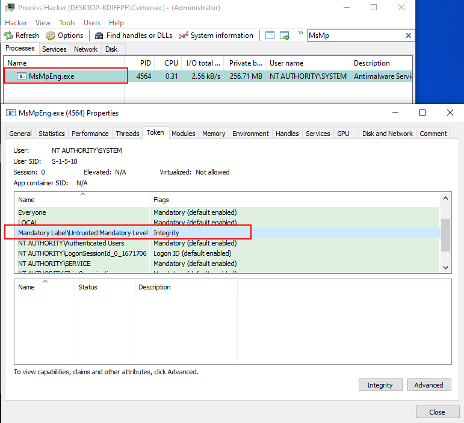

# KillDefenderBOF

KillDefenderBOF is a Beacon Object File PoC implementation of [pwn1sher/KillDefender](https://github.com/pwn1sher/KillDefender) which is based on research by [Gabriel Landau](https://twitter.com/GabrielLandau). The article can be found [here](https://elastic.github.io/security-research/whitepapers/2022/02/02.sandboxing-antimalware-products-for-fun-and-profit/article/).

KillDefenderBOF makes use of direct syscalls powered by [Sh0ckFR/InlineWhispers2](https://github.com/Sh0ckFR/InlineWhispers2).

> gcc -o KillDefender.o -c KillDefender.c -masm=intel

